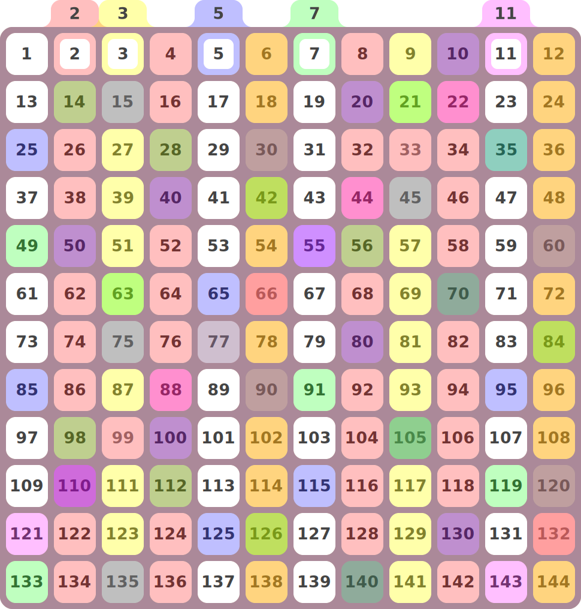

## Sieve of Eratosthenes Cutout Pattern Generator

JavaScript program to generate SVG shapes for a physical [Sieve of Eratosthenes](https://en.wikipedia.org/wiki/Sieve_of_Eratosthenes) that can be cut out by a laser cutter or printed on transparent sheets.

https://jjclark1982.github.io/primes/

### Example

### Future Work

Similar visualizations that this could be adapted to:

- https://en.wikipedia.org/wiki/Ulam_spiral
- https://en.wikipedia.org/wiki/Gaussian_integer
- https://mathworld.wolfram.com/GaussianPrime.html
- https://mathworld.wolfram.com/EisensteinPrime.html
- https://en.wikipedia.org/wiki/Coprime_integers
- https://www.youtube.com/watch?v=4EXVtn08Rxg

